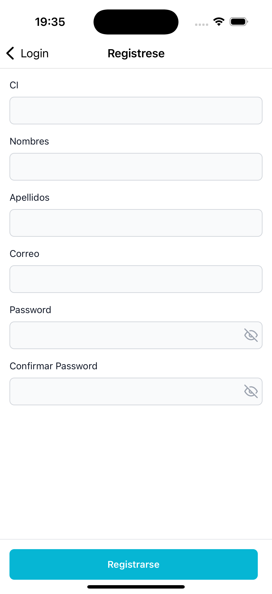

## 🚀 Pasos para el uso

Puedes descargar el apk si tienes un dispositivo Android [APK](https://drive.google.com/file/d/1XA4L8ep2tFpinrRGBIxQr65B2qVU_pjS/view?usp=sharing), lo instalas en tu dispositivo y estara listo para usarse.

Si deseas ejecutarlo en tu PC sigue estos pasos

1. Instalar [NodeJS](https://nodejs.org/en/), necesitamos tener instalado el empaquetador para usar `npm`
2. Clonar el repositorio usando el comando `git clone https://github.com/Mario-Tubay/Front-Apptlink.git`.
3. Ejecutar el comando.
```bash
npm install
```
4. Necesita tener instalado el IDE `(ANDROID STUDIO)` o si prefiere Iphone `(XCode)` y seguir los pasos que recomienda [React Native](https://reactnative.dev/docs/set-up-your-environment) para configurar el ambiente para desarrollo.
5. Una vez seguido los pasos anterirores puede correr el proyecto usando el comando:
```bash
npx expo start 
```

Use el framework de [React Native](https://reactnative.dev/) mas popular y que la documentacion de react native recomienda que es [Expo](https://docs.expo.dev/) 

### Para el backend use el Framework de [Laravel](https://laravel.com/) puedes revisar el repositorio [Aqui](https://github.com/Mario-Tubay/back-apptlink.git)

## ¿Cómo decidió las opciones técnicas y arquitectónicas utilizadas como parte de su solución?
Elegi [Expo](https://docs.expo.dev/)  por varias razones:
1. #### Desarrollo mucho mas rapido:
 Expo ofrece un entorno de desarrollo muy rápido y eficiente, lo que permite desarrollar aplicaciones sin necesidad de configurar un entorno nativo completo.

2. #### Acceso a funcionalidades: 
El framework ya viene listo y configurado para el uso de una gran cantidad de APIs, esto facilita la implementacion cuando se requiera el uso de la camara, notificaciones, etc...

3. #### Documentación:
Ya viene con una documentacion completa y muy facil de entender por lo que resolver problemas seria muy sencillo, ademas de la comunidad muy amplia que tiene ya que el uso de este framework cada vez es mas popular.

### Algunas imagenes de la App 

### Login


### Registro



### Pantalla de recuperar password


### Pantalla dashboard


### Pantalla pedidos


### Pantalla productos


### Pantalla Editar Pedidos


### Pantalla Servicio Auth

